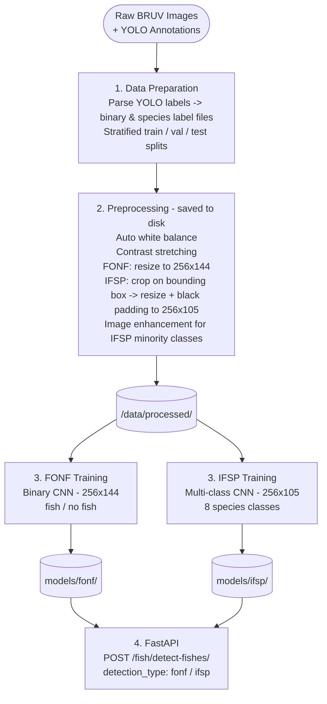

# 🎣 Baitwatch

[](https://www.python.org/downloads/)
[](https://www.tensorflow.org/)
[](https://keras.io/)
[](https://opencv.org/)
[](LICENSE)
[](#-dataset)

**Baitwatch** is a deep learning project for automated fish analysis in underwater imagery from BRUV (Baited Remote Underwater Video) deployments. Built on the **Tassie BRUV** benchmark dataset (2025), it trains convolutional neural network (CNN) models to answer two questions from a single photograph:

1. 🐟 **Is there a fish in this image?** — **FONF** (Fish Or No Fish): binary detection model
2. 🔬 **What species is it?** — **IFSP** (Individual Fish Species Prediction): multi-class species classification model

A stretch objective explores **transfer learning with YOLO26** for end-to-end fish detection and classification in a single forward pass.

---

## 👥 Contributors

| Name                | GitHub                                                  |
|---------------------|---------------------------------------------------------|
| LeGregs             | [@LeGregs](https://github.com/LeGregs)                  |
| Aurelien Chagnon    | [@Aurelien-Chagnon](https://github.com/AurelienChagnon) |
| Martin Piemont      | [@Martin-Piemont](https://github.com/Martsk23)          |
| Maximilien Heremans | [@Maximilien-Heremans](https://github.com/MaxH16)       |
| MHR-cloud           | [@MHR-cloud](https://github.com/MHR-cloud)              |

---

## 📋 Table of Contents

- [Contributors](#-contributors)
- [Background](#-background)
- [Dataset](#-dataset)
- [Installation](#-installation)
- [Pipeline Overview](#-pipeline-overview)
- [Usage](#-usage)
- [Model Architectures](#-model-architectures)
- [Handling Class Imbalance](#-handling-class-imbalance)
- [Results](#-results)
- [Stretch Objective: Transfer Learning with YOLO26](#-stretch-objective-transfer-learning-with-yolo26)
- [Stretch Objective: Grad-CAM Visualisation *(not met)*](#-stretch-objective-grad-cam-visualisation-not-met)
- [Limitations](#-limitations)
- [References](#-references)

---

## 🌊 Background

Monitoring marine biodiversity is essential for conservation management, yet it is costly and labour-intensive when done manually. BRUV systems provide a reproducible, non-invasive sampling method — but reviewing hours of footage requires significant expert time.

**Baitwatch** automates two core annotation tasks:

- **FONF (Fish Or No Fish)** — filters out empty frames, reducing the volume of footage that needs expert review by orders of magnitude.
- **IFSP (Individual Fish Species Prediction)** — identifies *which* species is present, enabling biodiversity indices to be computed automatically.

The project treats each task as a **separate, independently used CNN**, trained end-to-end on still frames extracted from the Tassie BRUV dataset. Both models share a common image preprocessing pipeline but are invoked independently at inference time via a **FastAPI** REST API. As a stretch goal, a fine-tuned **YOLO26** model combines both tasks into a single object detection network.

---

## 📦 Dataset

**Tassie BRUV: A benchmark data set for computer vision and movement quantification algorithms** (2025)

The Tassie BRUV dataset contains annotated underwater images collected using stereo BRUV rigs deployed off the coast of Tasmania, Australia. It is designed explicitly to benchmark computer vision algorithms under ecologically realistic conditions: variable water clarity, complex reef backgrounds, partial occlusions, and significant class imbalance due to the natural rarity of certain species.

| Property                    | Details                                                                                          |
|-----------------------------|--------------------------------------------------------------------------------------------------|
| Media type                  | Still frames extracted from MP4 BRUV video sequences                                             |
| Annotation format           | Bounding boxes + species labels (YOLO format — per-image `.txt` files)                           |
| Total annotations           | 5,222 fish bounding boxes across 1,912 labelled frames                                           |
| Raw species                 | 19 fish species identified at species level                                                      |
| Grouped classes             | 8 classes (rare species merged into higher-order taxonomic groups)                               |
| Key challenge               | Severe class imbalance — *Platycephalus bassensis* alone accounts for 3,834 of 5,222 annotations |
| Environment                 | Temperate reef habitat, Tasmania, Australia                                                      |
| Training / Val / Test split | 1,340 / 192 / 380 frames                                                                         |

### Species Classes

The 19 raw species observed in the dataset are grouped into **8 classification classes** used for model training, after merging taxa with low annotation counts into morphologically similar higher-order groups. The dominant class by a large margin is the **Southern Sand Flathead** (*Platycephalus bassensis*), a camouflaged benthic species that accounts for ~73% of all annotations.

| Class ID | Class Name             | Common Name                     | Approx. Annotations (train split) | Notes |
|----------|------------------------|---------------------------------|-----------------------------------|-------|
| 0        | `Carcharhiniformes`    | Ground sharks                   | 168                               | —     |
| 1        | `Chyrosophyrs auratus` | Australasian Snapper            | 210                               | —     |
| 2        | `Moridae`              | Morid cods                      | 67                                | —     |
| 3        | `Perciformes_sandy`    | Sandy-habitat perch-like fishes | 87                                | —     |
| 4        | `Perciformes_silver`   | Silver perch-like fishes        | 292                               | —     |
| 5        | `Ray`                  | Rays                            | 93                                | —     |
| 6        | `Scorpaeniformes`      | Scorpionfish & flatheads        | 2660                              | —     |
| 7        | `Tetradontiformes`     | Pufferfish & filefish           | 70                                | —     |

> **Note:** Class names and IDs match those defined in `training_data_species_grouped/data.yaml`. Refer to the paper *"The Motion Picture"* (Maslen et al., 2025) for the full grouping rationale.

> **Access:** Download the dataset from the official data portal (see reference *Tassie BRUV: A benchmark data set for computer vision and movement quantification algorithms*. Dryad.). Place the raw data under `data/raw/` folder.

---

## ⚙️ Installation

### Prerequisites

- Python 3.11+
- uv project manager ([official installation guide](https://docs.astral.sh/uv/getting-started/installation/))
- Invoke task runner (`pip install invoke`)
- CUDA-capable GPU recommended (≥ 6 GB VRAM)
- TensorFlow 2.x with GPU support ([official installation guide](https://www.tensorflow.org/install))
- FastAPI + Uvicorn (`pip install fastapi uvicorn`)

### 1. Clone the repository

```bash
git clone https://github.com/your-org/baitwatch.git
cd baitwatch
```

### 2. Create and activate the environment

Using **uv**:

```bash
uv sync --dev
source .venv/bin/activate        # Windows: .venv\Scripts\activate
```

### 3. Install in editable mode

```bash
pip install -e .
```

> **Note:** The project uses **Invoke** for task management. All commands are available as `invoke` tasks. Use `invoke --list` to see all available tasks.

### 4. Verify installation

```bash
python -c "import tensorflow as tf; print(tf.__version__); print(tf.config.list_physical_devices('GPU'))"
```

---

## 🔬 Pipeline Overview

FONF and IFSP are trained and served **independently**, but share a common preprocessing pipeline. Preprocessed images are **saved to disk** before any training begins, so both models consume the same processed outputs at their respective resolutions.



### Data Preparation

Since the Tassie BRUV dataset ships with annotations already in **YOLO format** (per-image `.txt` files containing `class_id cx cy w h` normalised coordinates), no format conversion is required. The preparation scripts parse these labels directly to build the **FONF** binary detection and **IFSP** species classification datasets:

```bash
invoke preprocess --dataset fonf   # prepare and save FONF dataset (256×144)
invoke preprocess --dataset ifsp   # crop on bounding box → resize + black padding to 256×105 + image enhancement
```

### Preprocessing

All images go through a shared base pipeline before model-specific resizing, implemented with **OpenCV**:

1. **Auto white balance** — corrects the strong blue/green colour cast inherent to underwater imagery, improving colour consistency across frames recorded at different depths and times of day.
2. **Contrast stretching** — linearly rescales pixel intensities to the full [0, 255] range, compensating for low-contrast scenes caused by light attenuation underwater.
3. **Resize** — images are resized to the resolution expected by each model, with different strategies per model:

| Model | Resize strategy                                                             | Resolution   |
|-------|-----------------------------------------------------------------------------|--------------|
| FONF  | Direct resize                                                               | 256 × 144 px |
| IFSP  | Crop on bounding box → resize → black padding (preserves fish aspect ratio) | 256 × 105 px |

### Image Enhancement for IFSP (Class Imbalance)

To improve IFSP generalisation and help address class imbalance, image enhancement is applied to **all training images** regardless of class. Combined with `class_weight` during training, this ensures the model is exposed to varied representations of every species. Enhancement is applied to the **training set only** — validation and test sets use original images exclusively.

- **Random horizontal flip** — doubles effective sample count at no cost
- **Random rotation** — accounts for varying fish orientations in BRUV footage
- **Random zoom** — simulates different distances from the camera
- **Random brightness & contrast jitter** — simulates variable depth lighting and turbidity
- **Gaussian noise** — simulates sensor and compression artefacts

Enhanced images are saved to `/data/processed/ifsp_augmented/`, organised as follows:

```
/data/processed/ifsp_augmented/
├── train/
│   ├── 0/    # Carcharhiniformes
│   ├── 1/    # Chyrosophyrs auratus
│   ├── ...
│   └── 7/    # Tetradontiformes
├── test/     # original images only — no augmentation applied
│   ├── 0/
│   └── ...
└── val/      # original images only — no augmentation applied
    ├── 0/
    └── ...
```

### Preprocessing Outputs

After running the preprocessing and augmentation commands, the full `/data/processed/` directory is structured as follows:

- `/data/processed/fonf/` — images organized into `fish/` and `no_fish/` subdirectories at 256×144, ready for `keras.utils.image_dataset_from_directory`.
- `/data/processed/ifsp/` — images cropped on bounding box, resized with black padding to 256×105, organized by species label.
- `/data/processed/ifsp_augmented/` — produced by `invoke augment`; enhanced training images for all classes, organized by split (`train/`, `test/`, `val/`) then by class ID (`0/`, `1/`, …`7/`).

---

## 🚀 Usage

All workflow steps are available as **Invoke tasks**. Run them in order the first time you set up the project.

### 1. Download the dataset

```bash
invoke download-data
```

Downloads the Tassie BRUV dataset and places it under `data/raw/`.

### 2. Preprocess & save images

```bash
invoke preprocess --dataset fonf   # auto white balance + contrast stretch + resize to 256×144
invoke preprocess --dataset ifsp   # auto white balance + contrast stretch + crop on bounding box
                                   # → resize + black padding to 256×105
invoke augment                     # apply image enhancement (training set only)
                                   # requires preprocess --dataset fonf/ifsp to be run first
```

Preprocessed images are saved to disk under `/data/processed/` before any training begins.

### 3. Train models

```bash
invoke train --dataset fonf              # train the FONF binary detector
invoke train --dataset ifsp              # train the IFSP species classifier
invoke train --dataset ifsp --augmented   # train IFSP with augmented data
```

Trained model weights are saved to `models/fonf/` and `models/ifsp/` respectively.

### 4. Evaluate models

```bash
invoke evaluate --dataset fonf   # evaluate FONF on the test split (never-seen images)
invoke evaluate --dataset ifsp   # evaluate IFSP on the test split (never-seen images)
```

Runs inference on the held-out test set — images the models have never seen during training or validation — and outputs evaluation metrics.

### 5. Classification report

```bash
invoke report --dataset fonf   # display classification report for FONF
invoke report --dataset ifsp   # display classification report for IFSP
```

Prints per-class precision, recall, F1 and overall accuracy.

### 6. Start the API

```bash
invoke api                          # start API server
invoke api --reload                 # start API with auto-reload
invoke api --host 0.0.0.0 --port 8080   # custom host/port
```

The API will be available at `http://localhost:8000`. Interactive documentation is auto-generated at `http://localhost:8000/docs`.

### 7. Convenience Tasks

```bash
invoke setup                              # install requirements + package
invoke full-pipeline --dataset fonf       # run complete pipeline: preprocess -> train -> evaluate -> report
invoke full-pipeline-augmented --dataset ifsp   # run pipeline with augmentation
```

### Direct Module Execution

You can also run commands directly using Python modules:

```bash
python -m baitwatch download-data
python -m baitwatch preprocess fonf
python -m baitwatch train ifsp --augmented
python -m baitwatch evaluate fonf
python -m baitwatch report ifsp
python -m baitwatch cycle fonf
python -m baitwatch augment fonf
python -m baitwatch api --host 0.0.0.0 --port 8080 --reload
```

Or if you are using `uv`

```bash
uv run -m baitwatch download-data
uv run -m baitwatch preprocess fonf
uv run -m baitwatch train ifsp --augmented
uv run -m baitwatch evaluate fonf
uv run -m baitwatch report ifsp
uv run -m baitwatch cycle fonf
uv run -m baitwatch augment fonf
uv run -m baitwatch api --host 0.0.0.0 --port 8080 --reload
```

### API Endpoints

The API provides a RESTful interface with proper validation and error handling.

#### `GET /` — Root Endpoint

Returns a welcome message.

```bash
curl http://localhost:8000/api/v1/
```

```json
{
  "message": "Welcome to Baitwatch API"
}
```

#### `GET /ping/` — Health Check

Returns a simple pong response for health monitoring.

```bash
curl http://localhost:8000/api/v1/ping/
```

```json
["pong"]
```

#### `POST /fish/detect-fishes/` — Fish Detection

Both models are served through a single endpoint under the `/fish` router. The `detection_type` parameter selects which model to run.

**Parameters:**

| Parameter        | Type         | Values               | Description                                      |
|------------------|--------------|----------------------|--------------------------------------------------|
| `detection_type` | `string`     | `"fonf"` \| `"ifsp"` | Model to use for inference                       |
| `image_file`     | `file`       | JPEG, PNG, WebP      | Image file to analyze (max 10MB)                 |

**Validation:**

- **Content Type**: Only `image/jpeg`, `image/png`, and `image/webp` are accepted
- **File Size**: Maximum 10MB
- **Image Format**: Must be a valid, parseable image file

**Response Codes:**

| Code | Description                                                      |
|------|------------------------------------------------------------------|
| 200  | Success — returns prediction result                              |
| 400  | Bad Request — invalid file type                                  |
| 413  | Payload Too Large — file exceeds 10MB limit                      |
| 422  | Unprocessable Entity — corrupted or invalid image data           |
| 500  | Internal Server Error — model unavailable or detection failure   |

**Example — FONF (fish / no fish):**

```bash
curl -X POST "http://localhost:8000/api/v1/fish/detect-fishes/" \
     -F "detection_type=fonf" \
     -F "image_file=@path/to/image.jpg"
```

**Response when fish is detected:**

```json
{
  "detection_type": "fonf",
  "prediction": "fish",
  "confidence": 0.97,
  "class_id": 1,
  "class_name": null,
  "common_name": null
}
```

**Response when no fish is detected:**

```json
{
  "detection_type": "fonf",
  "prediction": "no_fish",
  "confidence": 0.89,
  "class_id": 0,
  "class_name": null,
  "common_name": null
}
```

> For FONF: `prediction` is either `"fish"` or `"no_fish"`. The `confidence` score indicates how certain the model is about its prediction.

**Example — IFSP (species identification):**

```bash
curl -X POST "http://localhost:8000/api/v1/fish/detect-fishes/" \
     -F "detection_type=ifsp" \
     -F "image_file=@path/to/image.jpg"
```

```json
{
  "detection_type": "ifsp",
  "prediction": "Scorpaeniformes",
  "confidence": 0.84,
  "class_id": 6,
  "class_name": "Scorpaeniformes",
  "common_name": "Scorpionfish & flatheads"
}
```

> For IFSP: The response includes both the scientific/taxonomic name (`class_name`) and the common name (`common_name`) of the identified species. The `confidence` score indicates the model's certainty. Refer to the [Species Classes](#species-classes) table for all possible species.

**Response Fields:**

| Field            | Type    | Description                                                          |
|------------------|---------|----------------------------------------------------------------------|
| `detection_type` | string  | Type of detection performed (`"fonf"` or `"ifsp"`)                  |
| `prediction`     | string  | Human-readable prediction (e.g., `"fish"`, `"Scorpaeniformes"`)     |
| `confidence`     | float   | Confidence score between 0.0 and 1.0                                 |
| `class_id`       | integer | Numeric class identifier (0-1 for FONF, 0-7 for IFSP)                |
| `class_name`     | string  | Scientific/taxonomic name (IFSP only, `null` for FONF)               |
| `common_name`    | string  | Common name in plain English (IFSP only, `null` for FONF)            |

**Error Response Example:**

```bash
curl -X POST "http://localhost:8000/api/v1/fish/detect-fishes/" \
     -F "detection_type=fonf" \
     -F "image_file=@path/to/document.pdf"
```

```json
{
  "detail": "Invalid image file type. Supported types: image/jpeg, image/png, image/webp"
}
```

**Interactive API Documentation:**

FastAPI automatically generates interactive documentation:

- **Swagger UI**: `http://localhost:8000/docs`
- **ReDoc**: `http://localhost:8000/redoc`

---

## 🏗 Model Architectures

Both models are **custom CNNs built from scratch** using the Keras functional API, without any pre-trained weights. All models are saved in the native `.keras` format. Each model has its own input resolution reflecting the aspect ratio of cropped BRUV frames after preprocessing.

### FONF — Fish Or No Fish (Binary Detector)

A lightweight binary classifier. Input images are resized to **256 × 144 px** before being fed to the network.

```
Input: RGB image (256 × 144 × 3)
│
├── Rescaling (÷ 255)
│
├── Conv2D(32, 3×3, padding='same', he_uniform) → BatchNorm(0.99) → LeakyReLU(0.01)
├── Conv2D(32, 3×3, padding='same', he_uniform) → BatchNorm(0.99) → LeakyReLU(0.01)
├── MaxPooling2D(2×2)
│
├── Conv2D(64, 3×3, he_uniform) → BatchNorm(0.99) → LeakyReLU(0.01)
├── Conv2D(64, 3×3, he_uniform) → BatchNorm(0.99) → LeakyReLU(0.01)
├── MaxPooling2D(2×2)
│
├── Conv2D(128, 3×3, he_uniform) → BatchNorm(0.99) → LeakyReLU(0.01)
├── Conv2D(128, 3×3, he_uniform) → BatchNorm(0.99) → LeakyReLU(0.01)
├── MaxPooling2D(2×2)
│
├── Flatten
├── Dense(64, relu)
├── Dropout(0.1)
├── Dense(8, relu)
└── Dense(1, sigmoid)

Output: P(fish present) ∈ [0, 1]
```

**Loss:** `BinaryCrossentropy` — fish / no fish classes are balanced enough in the dataset to not require class weighting.

**Optimiser:** `Adam` with `ExponentialDecay` learning rate schedule.

**Callbacks:** `EarlyStopping(patience=5)`.

---

### IFSP — Individual Fish Species Prediction (Species Classifier)

A deeper CNN for fine-grained species identification across the **8 grouped classes** of the Tassie BRUV dataset. Input images are cropped on the fish bounding box, then resized with black padding to **256 × 105 px** to preserve the original fish aspect ratio.

```
Input: RGB image (256 × 105 × 3)
│
├── Rescaling (÷ 255)
│
├── Conv2D(32,  3×3, padding='same', he_uniform) → BatchNorm(0.99) → LeakyReLU(0.01)
├── MaxPooling2D(2×2)
│
├── Conv2D(64,  3×3, padding='same', he_uniform) → BatchNorm(0.99) → LeakyReLU(0.01)
├── MaxPooling2D(2×2)
│
├── Conv2D(128, 3×3, padding='same', he_uniform) → BatchNorm(0.99) → Dropout(0.1) → LeakyReLU(0.01)
├── MaxPooling2D(2×2)
│
├── Conv2D(256, 3×3, padding='same', he_uniform) → BatchNorm(0.99) → Dropout(0.1) → LeakyReLU(0.01)
├── MaxPooling2D(2×2)
│
├── Conv2D(512, 3×3, padding='same', he_uniform) → BatchNorm(0.99) → Dropout(0.1) → LeakyReLU(0.01)
├── MaxPooling2D(2×2)
│
├── Flatten
├── Dense(256, relu)
├── Dropout(0.1)
├── Dense(64,  relu)
└── Dense(8,   softmax)

Output: probability distribution over 8 species classes
```

**Loss:** `CategoricalCrossentropy`.

**Optimiser:** `Adam` with `ExponentialDecay` learning rate schedule.

**Callbacks:** `EarlyStopping(patience=5)`.

---

## ⚖️ Handling Class Imbalance

Class imbalance is the central challenge for IFSP: *Scorpaeniformes* (dominated by *Platycephalus bassensis*) accounts for ~73% of all annotations, while several species classes have fewer than ten examples. Baitwatch addresses this at three levels:

**Data level** — Image enhancement (flips, rotations, zoom, brightness/contrast jitter, Gaussian noise) is applied to **all IFSP training images** and saved to `/data/processed/ifsp_augmented/`. Stratified splits preserve the original class distribution across train, validation, and test sets.

**Training level** — `class_weight` is passed to `model.fit()` during IFSP training, computed from inverse class frequencies. This penalises the model more heavily for misclassifying rare species, compensating for the dominant presence of *Scorpaeniformes*.

**Loss level** — `BinaryCrossentropy` for FONF.; `CategoricalCrossentropy` for IFSP

**Evaluation level** — Per-class F1 and recall are always reported alongside overall accuracy, so strong performance on the dominant class cannot mask failure on rare ones.

Class weights are computed automatically from inverse class frequencies at training time.

---

## 📈 Results

The following metrics are tracked for each model:

| Metric           | Task | Notes                                                           |
|------------------|------|-----------------------------------------------------------------|
| Accuracy         | Both | Overall; insufficient alone under class imbalance               |
| F1 Score (macro) | Both | Treats all classes equally — key metric for rare species        |
| Per-class Recall | IFSP | Species-level sensitivity; critical for biodiversity monitoring |
| Confusion Matrix | Both | Displayed via `invoke report --dataset <fonf                    |ifsp>` |
| ROC-AUC          | FONF | Binary classification quality across all thresholds             |

Metrics computed on the **validation set** unless noted. Confusion matrices available via `invoke report --dataset fonf` / `invoke report --dataset ifsp`.

To contextualise model performance, each CNN is compared against a naive baseline that requires no training. A meaningful model must clearly outperform these baselines — particularly on rare species — to justify the complexity of a deep learning approach.

### FONF — Fish Or No Fish

**FONF baseline — Majority class classifier:**

Always predicts the most frequent class in the training set (fish or no fish, whichever is more common). Any FONF model must exceed this accuracy and, critically, achieve substantially higher recall on the minority class.

| Model                   | Accuracy | F1 (macro) | ROC-AUC           |
|-------------------------|----------|------------|-------------------|
| Majority class baseline | ~56%     | —          | 0.50              |
| FONF (custom CNN)       | **0.89** | **0.89**   | **0.92** *(test)* |

**Per-class results on the validation set (192 samples):**

| Class         | Precision | Recall   | F1       | Support |
|---------------|-----------|----------|----------|---------|
| No fish       | 0.89      | 0.86     | 0.87     | 84      |
| Fish          | 0.89      | 0.92     | 0.90     | 108     |
| **Macro avg** | **0.89**  | **0.89** | **0.89** | 192     |
| Weighted avg  | 0.89      | 0.89     | 0.89     | 192     |

### IFSP — Individual Fish Species Prediction

**IFSP baseline — Uniform random classifier:**

Predicts each of the 8 species classes with equal probability (1/8 = 12.5% per class). Given the severe imbalance in the dataset, a model that simply predicts *Scorpaeniformes* every time would score high accuracy but near-zero macro F1 — this stratified random baseline avoids that trap.

| Model                   | Accuracy | F1 (macro) | Rare Species Recall |
|-------------------------|----------|------------|---------------------|
| Uniform random baseline | ~12.5%   | ~12.5%     | ~12.5%              |
| Majority class baseline | ~73%     | —          | ~0%                 |
| IFSP (custom CNN)       | **0.71** | **0.59**   | **0.40–0.81**       |

**Per-class results on the validation set (479 samples):**

| Class | Name                 | Precision | Recall   | F1       | Support |
|-------|----------------------|-----------|----------|----------|---------|
| 0     | Carcharhiniformes    | 0.54      | 0.71     | 0.61     | 21      |
| 1     | Chyrosophyrs auratus | 0.84      | 0.81     | 0.82     | 26      |
| 2     | Moridae              | 0.67      | 0.40     | 0.50     | 15      |
| 3     | Perciformes_sandy    | 0.30      | 0.60     | 0.40     | 10      |
| 4     | Perciformes_silver   | 0.56      | 0.73     | 0.64     | 56      |
| 5     | Ray                  | 0.50      | 0.40     | 0.44     | 5       |
| 6     | Scorpaeniformes      | 0.94      | 0.74     | 0.83     | 336     |
| 7     | Tetradontiformes     | 0.57      | 0.40     | 0.47     | 10      |
| —     | **Macro avg**        | **0.61**  | **0.60** | **0.59** | 479     |
| —     | Micro avg            | 0.80      | 0.71     | 0.75     | 479     |
| —     | Weighted avg         | 0.84      | 0.71     | 0.76     | 479     |

---

## 🎯 Stretch Objective: Transfer Learning with YOLO26

> **Status:** Experimental.

The two-stage CNN pipeline performs detection and classification as separate steps. As a stretch goal, **YOLO26** is fine-tuned on the Tassie BRUV dataset to perform both tasks simultaneously: localising each fish with a bounding box and assigning its species label in a single forward pass.

This approach mirrors the methodology described in *"The Motion Picture: Leveraging Movement to Enhance AI Object Detection in Ecology"*, which demonstrated that transfer learning from large-scale pre-trained weights substantially improves detection of rare and cryptic marine species compared to training from scratch.

### Why YOLO26?

- Pre-trained on COCO (120K images, 80 classes) — strong low-level feature representations transfer well to underwater imagery.
- State-of-the-art speed/accuracy trade-off for real-time ecological monitoring.
- Native support for custom datasets and fine-tuning with minimal configuration.

### Setup

```bash
pip install ultralytics
```

### Prepare the dataset configuration

Since the Tassie BRUV annotations are **already in YOLO format**, no conversion is needed.

### Fine-tune YOLO26

Key fine-tuning strategies applied:

- **Frozen backbone** for the first N epochs, then end-to-end fine-tuning — avoids catastrophic forgetting on small datasets.
- **Mosaic augmentation** enabled (YOLO26 default) — especially effective for rare classes with few training images.
- **Class-weighted loss** — rare species receive higher gradient contribution during training.
- **Augmented images** — use the augmented image from BRUV dataset to fine-tuned the YOLO26 model.

### Comparison: Custom CNN pipeline vs. YOLO26

| Aspect                   | FONF + IFSP (from scratch)           | YOLO26 (fine-tuned)        |
|--------------------------|--------------------------------------|----------------------------|
| Pre-trained weights      | None                                 | COCO (120K images)         |
| Task                     | Classification only                  | Detection + classification |
| Localisation             | No (image-level labels)              | Yes (bounding boxes)       |
| Training data needed     | High                                 | Low–medium                 |
| Rare species performance | Baseline                             | Expected improvement       |
| Inference speed          | Fast                                 | Fast                       |
| Interpretability         | Confusion matrix + per-class metrics | Built-in confidence scores |

### Results — YOLO26 Fine-tuned

Model: `YOLO26n` (fused) — 122 layers, 2,376,396 parameters, 5.2 GFLOPs. Inference speed: 38.6ms/image (CPU).
 
| Class                | Images   | Instances | P         | R         | mAP@0.5   | mAP@0.5:0.95 |
|----------------------|----------|-----------|-----------|-----------|-----------|--------------|
| **All**              | **1148** | **2834**  | **0.696** | **0.584** | **0.629** | **0.397**    |
| Carcharhiniformes    | 126      | 126       | 0.712     | 0.714     | 0.722     | 0.395        |
| Chyrosophyrs auratus | 146      | 152       | 0.833     | 0.888     | 0.901     | 0.663        |
| Moridae              | 72       | 90        | 0.746     | 0.457     | 0.520     | 0.306        |
| Perciformes_sandy    | 58       | 58        | 0.430     | 0.310     | 0.346     | 0.167        |
| Perciformes_silver   | 150      | 336       | 0.627     | 0.595     | 0.614     | 0.333        |
| Ray                  | 30       | 30        | 0.626     | 0.567     | 0.622     | 0.454        |
| Scorpaeniformes      | 446      | 1983      | 0.760     | 0.558     | 0.637     | 0.388        |
| Tetradontiformes     | 59       | 59        | 0.831     | 0.585     | 0.672     | 0.469        |
---

## 🔬 Stretch Objective: Grad-CAM Visualisation *(not met)*

> **Status:** Not implemented — planned for a future iteration.

The goal was to integrate **Grad-CAM** (Gradient-weighted Class Activation Mapping) to produce heatmap overlays highlighting the image regions most influential to each model's prediction. This would have provided a lightweight interpretability tool to help domain experts validate model behaviour and identify spurious correlations (e.g. a model attending to background reef texture rather than fish morphology).

**Why it was not completed** — time constraints during the current project cycle.

> **Reference:** Selvaraju, R. R. et al. (2017). *Grad-CAM: Visual Explanations from Deep Networks via Gradient-based Localization*. Proceedings of ICCV 2017.

---

## ⚠️ Limitations

- Both FONF and IFSP process each frame independently — no temporal context from surrounding video frames is used.
- IFSP does not perform bounding-box regression; it classifies at image level, assuming the fish fills most of the frame.
- Training and evaluation are scoped to Tasmanian reef habitats; performance on other ecosystems is untested.
- The YOLO26 stretch objective requires conversion to a non-Keras framework (`ultralytics`); a unified Keras-only detection pipeline is not yet implemented.

**Possible improvements:**

- **Temporal modelling** — exploiting frame sequences with ConvLSTM or video transformer models could improve detection of cryptic or transiently visible species.
- **Semi-supervised learning** — leveraging the large volume of unannotated BRUV footage via pseudo-labelling or consistency regularisation could improve generalisation.
- **Stereo data** — the dataset includes stereo pairs; depth information from stereo disparity could improve size-based species disambiguation.
- **On-device deployment** — TensorFlow Lite conversion could enable deployment on field-deployable hardware alongside BRUV rigs.

---

## 📚 References

1. Maslen, B., Popovic, G., Wang, D., Warton, D., & Langley, M. (2025). **Tassie BRUV: A benchmark data set for computer vision and movement quantification algorithms**. Dryad. https://doi.org/10.5061/dryad.sbcc2frf7

2. Maslen, B., Popovic, G., Wang, D., Jansen, A., & Warton, D. (2025). **The Motion Picture: Leveraging Movement to Enhance AI Object Detection in Ecology**. *Ecology and Evolution*, 15(8), e71996. https://doi.org/10.1002/ece3.71996

3. Jocher, G. et al. (2026). **Ultralytics YOLO26**. https://github.com/ultralytics/ultralytics

4. Chollet, F. et al. **Keras**. https://keras.io

---

## 📄 License

This project is licensed under the MIT License. See [LICENSE](LICENSE) for details.

The **Tassie BRUV dataset** is subject to its own licence — please refer to the dataset publication for conditions of use before redistributing data or models trained on it.

---

*Built for marine ecologists who would rather be diving than labelling frames.* 🤿
